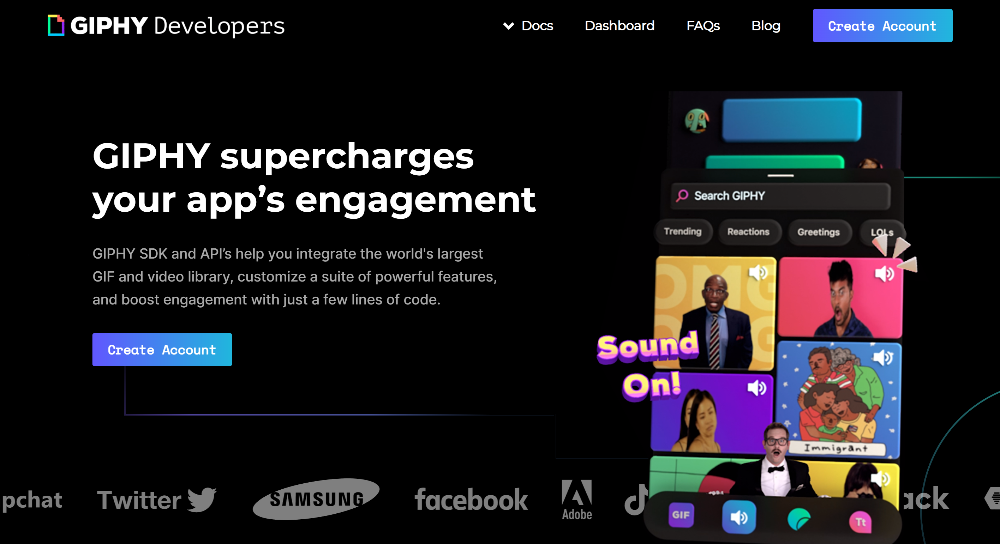
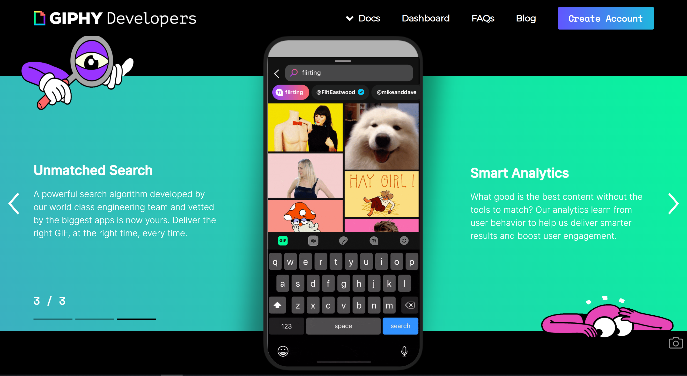

<!-- PROJECT LOGO -->
 

  
  <h3 align="center">GIPHY landing page</h3>

  

    I recreated the GIPHY landing page using SCSS and Vanilla Javascripts
     
    <a href="https://j0suke.github.io/GIPHY-site-vitrine/">View Demo</a>
  

<!-- TABLE OF CONTENTS -->

  
Table of Contents

  <ol>
    <li>
      <a href="#about-the-project">About The Project</a>
      <ul>
        <li><a href="#built-with">Built With</a></li>
      </ul>
    </li>
    <li><a href="#contact">Contact</a></li>
    <li><a href="#acknowledgments">Acknowledgments</a></li>
  </ol>

<!-- ABOUT THE PROJECT -->
## About The Project

In my learning journey of modern responsive web desing and javascripts Front End developement , i found this very interesting website https://developers.giphy.com/ and decided to creating it to test my knowledge , so here is the final version of the project (it took me 3 days in total)

### Built With

* [Sass](https://sass-lang.com/)
* [javascript](https://www.javascript.com/)

<!-- CONTACT -->
## Contact

* [twitter](https://twitter.com/Jean_M_____I)

* [Project Link](https://github.com/J0SUKE/GIPHY-site-vitrine)

<!-- ACKNOWLEDGMENTS -->
## Acknowledgments

Here are the ressources i used to build the page

* [GIPHY landing page](https://developers.giphy.com/)
* [Google fonts](https://fonts.google.com/)
* [icons8](https://icons8.com/icons/)

(<a href="#top">back to top</a>)
